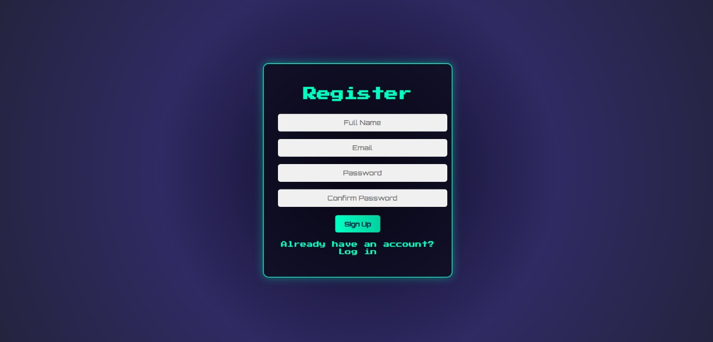
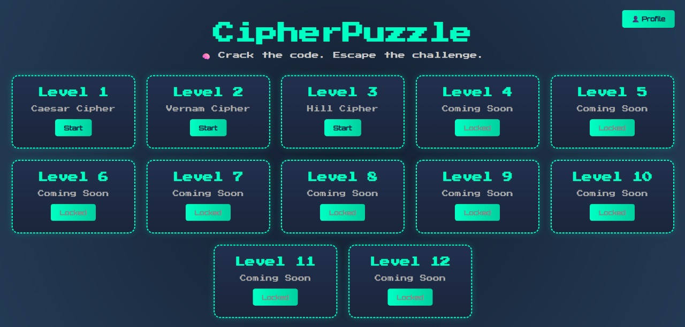
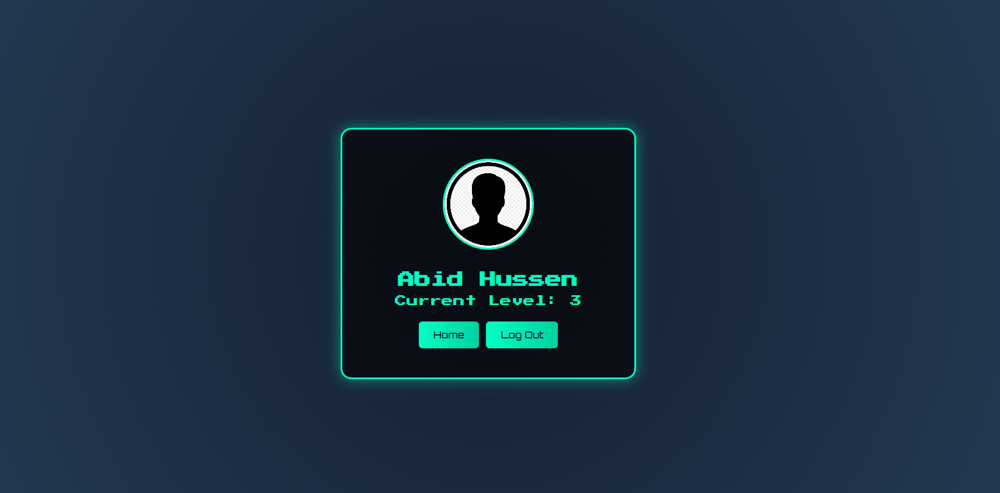

# 🧩 CipherPuzzle

**CipherPuzzle** is a web-based encryption-decryption puzzle game built with HTML, CSS, and JavaScript. The game features classic ciphers like Caesar, Vernam, and Hill cipher and challenges users to crack the code at each level to progress.

## 🎮 Game Features

- Caesar, Vernam, and Hill cipher-based puzzles  
- Clue changes on each reload to keep the challenge dynamic  
- Mysterious hints and time-based logic  
- Sound effects for clicks and celebrations  
- Background music that persists across levels  
- Splash screen and login/logout system via Firebase  
- Mobile responsive and interactive design  

## 🔧 Technologies Used

- HTML5 / CSS3  
- JavaScript (Vanilla)  
- Firebase Authentication & Firestore  
- Netlify for deployment  

## 🚀 How to Play

1. Log in using your credentials  
2. Start with Level 1 (Caesar Cipher)  
3. Solve puzzles using clues  
4. Progress to higher levels as they unlock

## 🌐 Live Demo

Check it out here: https://cipherpuzzle.netlify.app

## 📸 Screenshots

### 🔐 Login Page


### 📝 Register Page


### 🕹️ Game Levels


### 👤 Profile Page


## 📦 Folder Structure

```
CipherPuzzle/
│
├── Code/
│   ├── BookSelfImages/
│   ├── Clock images/
│   ├── sounds/
│   ├── complete.html
│   ├── desktop.ini
│   ├── favicon.png
│   ├── firebase-config.js
│   ├── index.html
│   ├── level1.html
│   ├── level2.html
│   ├── level3.html
│   ├── login.html
│   ├── logout.html
│   ├── profile.html
│   ├── profile_icon.png
│   └── registration.html
└── README.md
```

## 🐞 Bugs or Suggestions?

If you find any bugs or issues, feel free to open an issue or contact the developer.

## 🤝 Special Thanks

Contribution of my teammates **Abu Sufian Rafi** and **Noman Ahmed Rony**.
